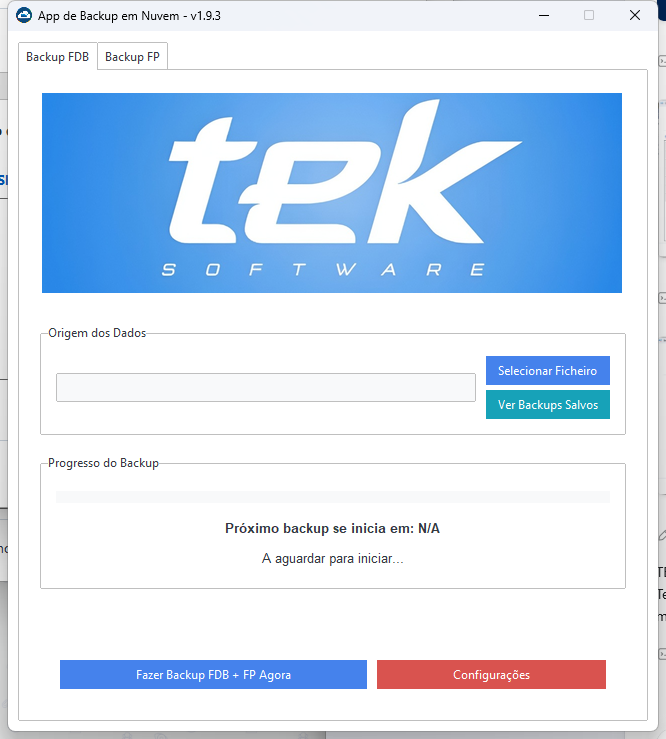

# TekFarma Backup

**Aplicativo Windows para automação de backups em nuvem**

O **TekFarma Backup** organiza e automatiza o envio de backups FDB e FP para a nuvem. A aplicação foi criada para tornar uma rotina crítica mais simples de operar e acompanhar.

## Principais recursos

- Seleção e envio de arquivos de backup FDB e FP.
- Execução manual e acompanhamento do próximo backup.
- Visualização dos backups salvos.
- Organização em subpastas diárias no Google Drive.
- Configuração de retenção por dias e quantidade máxima de arquivos.
- Proteção do token de acesso com o armazenamento seguro nativo do Windows.

## Download

Baixe a versão mais recente na página de [Releases](https://github.com/Nata-Felix/TekbackupExe/releases/latest).

## Distribuição

Este repositório disponibiliza a versão compilada do produto. O uso do aplicativo está sujeito aos termos descritos em [`LICENSE.txt`](LICENSE.txt).

## Ecossistema

O TekFarma Backup complementa as automações de instalação e suporte desenvolvidas no [TEK Toolkit](https://github.com/Nata-Felix/TEK-Toolkit).
